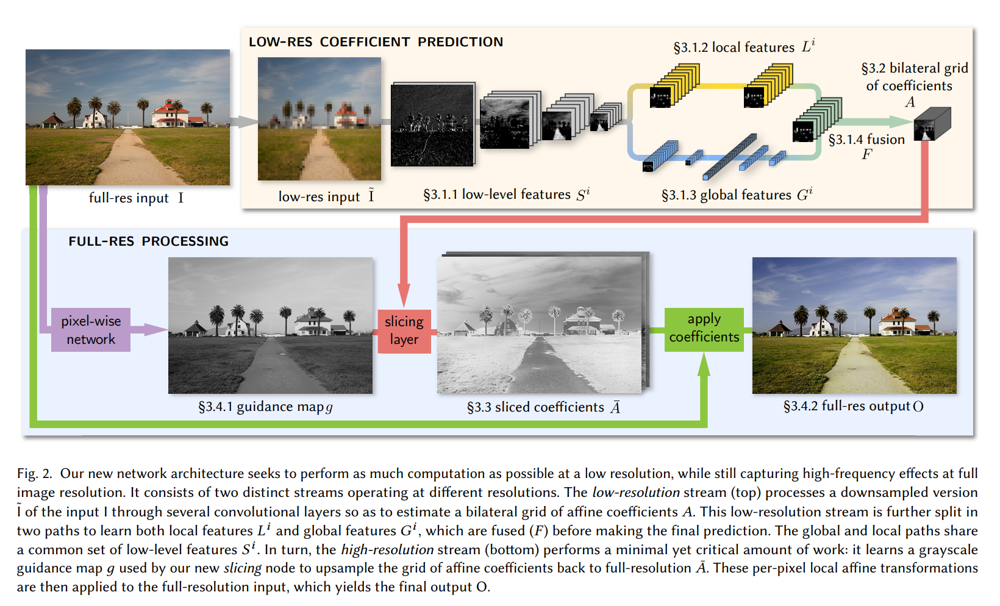
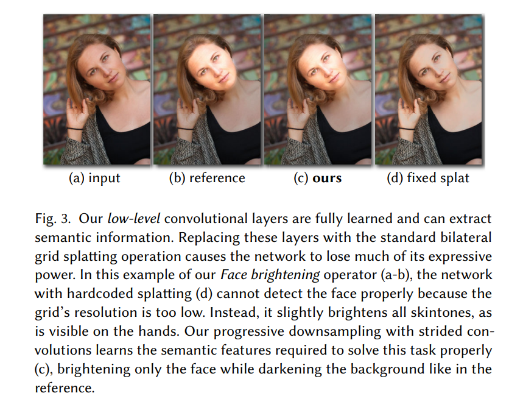
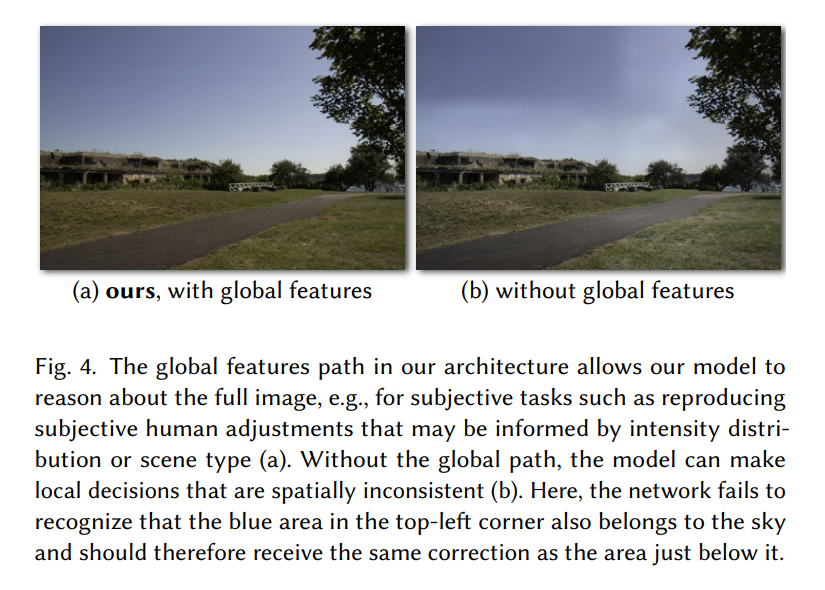

# Deep Bilateral Learning for Real-Time Image Enhancement
**http://dx.doi.org/10.1145/3072959.3073592**

## ABSTRACT
> The neural network proposed in this papar consumes a low-resolution version of the input image, produces a set of affine transformations in bilateral space, upsamples those transformations in an edge-preserving fashion using
> a new slicing node, and then applies those upsampled transformations to the full-resolution image.

## Architecture
> 1. **Low-level Feature**: can improve its expressive power and extract semantic features required to some specific task.
>    
> 2. **Global feature path**: comprises two strided convolutional layers followed by three fully-connected layers. Without global features path to encode global information of the input, the network can make erroneous local decisions that lead to artificts as examplified by the large-scale variations in the sky in Figure 4.
>    
> 3. A sum of scaled ReLU functions with thresholds and slopes can be used to predict Tone Mapping Curve.
