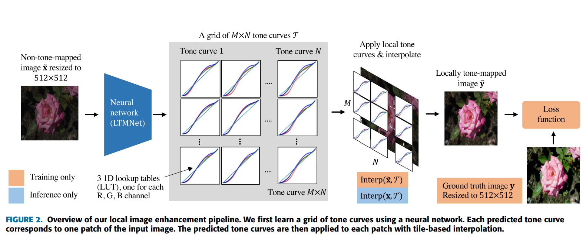

# Learning Tone Curves for Local Image Enhancement
**(Digital Object Identifier 10.1109/ACCESS.2022.3178745)**

## ABSTRACT
> This papar propose a local tone mapping network (LTMNet) that learns a grid of tone curves to locally enhance an image.

