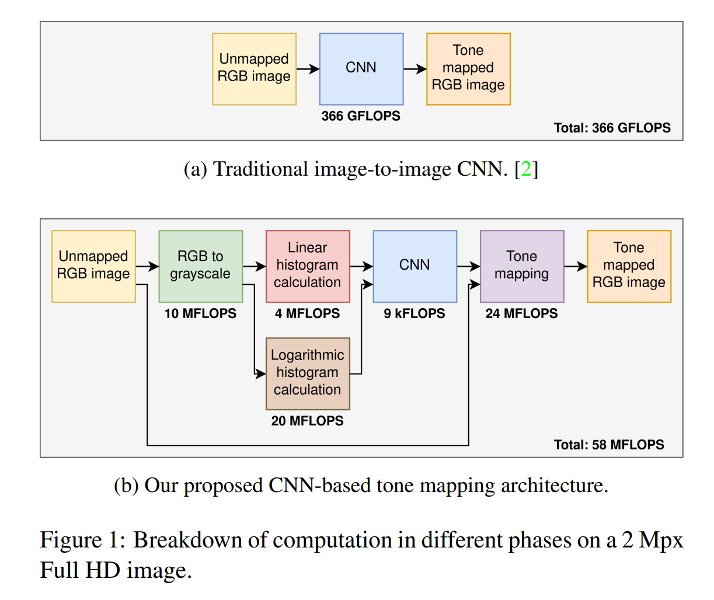
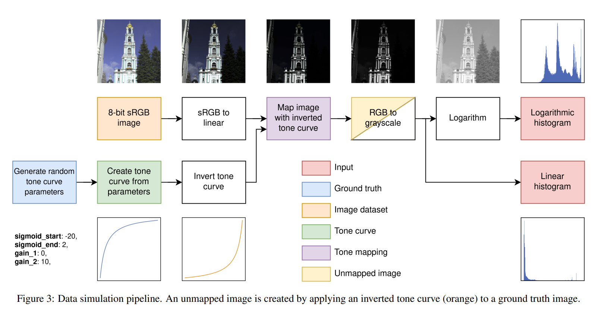

# TGTM: TinyML-based Global Tone Mapping for HDR Sensors

## ABSTRACT
> This proposed TinyML-based global tone mapping method, termed as TGTM, operates at 9,000 FLOPS per RGB image of any resolution.
> Additionally, TGTM offers a generic approach that can be incorporated to any classical tone mapping method.
> 

## Proposed Solution
> 

