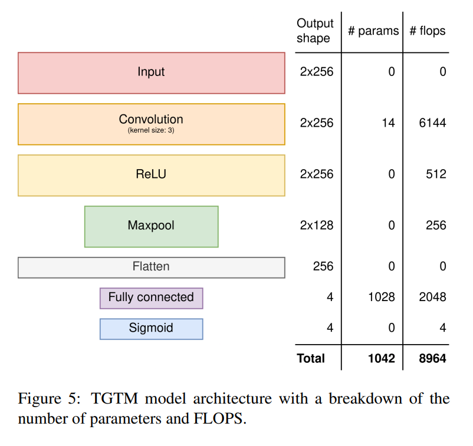

# TGTM: TinyML-based Global Tone Mapping for HDR Sensors

## ABSTRACT
> This proposed TinyML-based global tone mapping method, termed as TGTM, operates at 9,000 FLOPS per RGB image of any resolution.
> Additionally, TGTM offers a generic approach that can be incorporated to any classical tone mapping method.
> 
> 

## Proposed Solution
> 

## Dataset
>  HDR+ dataset [^1]: provides the meta data for each image, including tone mapping curves used in processing the raw images.
> MIT-Adobe FiveK [^2]: has employed five photography students in an art school to adjust the tone of the photos

## References
[^1]: Samuel W. Hasinoff, Dillon Sharlet, Ryan Geiss, Andrew Adams, Jonathan T. Barron, Florian Kainz, Jiawen Chen, and Marc Levoy. Burst photography for high dynamic range and low-light imaging on mobile cameras. ACM Transactions on Graphics (Proc. SIGGRAPH Asia), 35(6), 2016. https://hdrplusdata.org/. Accessed: 2024-04-11.
[^2]: Vladimir Bychkovsky, Sylvain Paris, Eric Chan, and Fredo Durand. Learning photographic global tonal adjustment with a database of input / output image pairs. In The TwentyFourth IEEE Conference on Computer Vision and Pattern Recognition, 2011. https://data.csail.mit.edu/graphics/fivek/. Accessed: 2024-04-11.
